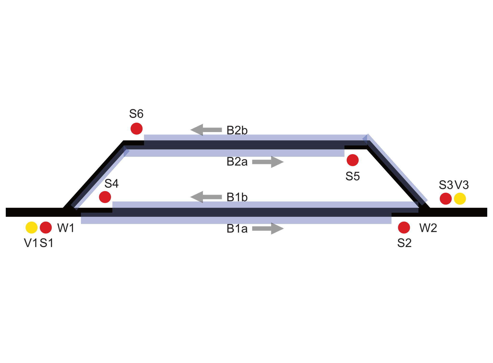

# simple example

View the template file here: [template.open-interlocking.yml](template.opinterlockingerk.yml)

## Track diagram

- Yellow circles are distant signals.
- Red circles are signals.
- blue transparent parts are (sub)blocks
- the arrow shows the direction of the subblock